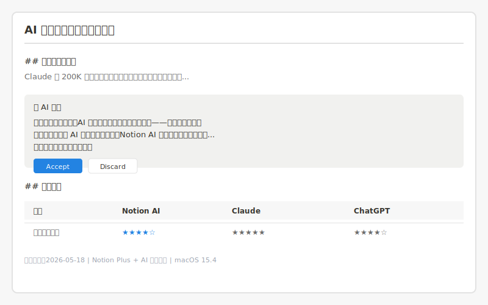
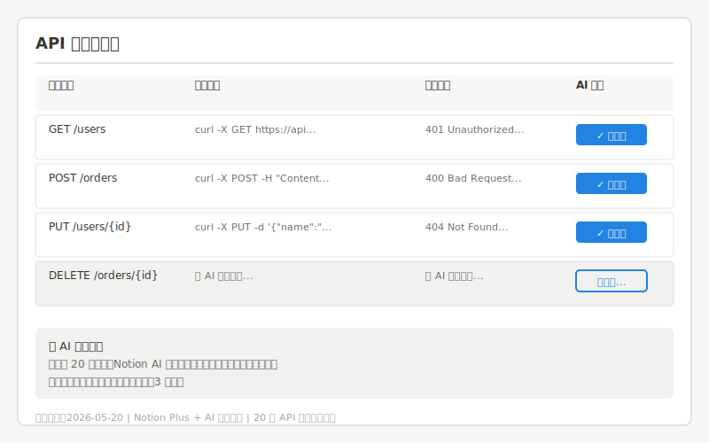
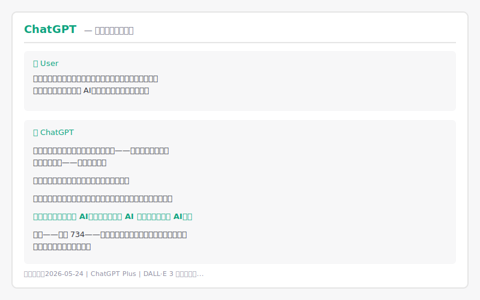

> **AI Tool Review Column · Issue 5**
>
> When AI evolves from "chatbot" to "writing partner," Notion AI's "embedded assistance," Claude's "long-form depth," and ChatGPT's "versatile coverage" — which one can truly boost your writing efficiency?

---

## Review Background

In 2026, AI writing tools have moved far beyond "helping you write a paragraph." Notion AI embeds generation capabilities into every document block, Claude has become synonymous with long-form writing thanks to its 200K context window, and ChatGPT covers the complete pipeline from idea capture to publication through multimodal capabilities and a vast plugin ecosystem.

These three tools represent three fundamentally different philosophies of AI-assisted writing:

- **Notion AI** → Workflow-embedded "invisible assistant"; AI is part of your document
- **Claude** → Long-form "professional editor"; AI is an extension of your thinking
- **ChatGPT** → All-around "creative partner"; AI is your brainstorming companion

Discussions among Chinese content creators are lively but mostly superficial — either single-feature tests or personal preference debates. This review fills the gap with real-world, scenario-based testing.

**Testing setup:**

- **Duration**: 2026-05-05 to 2026-05-27 (three weeks)
- **Scenarios**:
  1. Drafting a technical blog post (outline to final draft, ~4,000 words, bilingual Chinese/English)
  2. Writing API technical documentation (code examples, parameter tables, version notes, ~3,000 words)
  3. Writing a short sci-fi story (~2,500 words)
  4. Cross-workflow integration testing (Notion, Obsidian, VS Code)
- **Environment**: macOS 15.4, VS Code 1.99, Obsidian 1.7
- **Methodology**: Each scenario executed fully across all three tools/platforms
- **Subscriptions**: Notion AI (Notion Plus $10/mo + AI add-on $10/mo), Claude Pro ($20/mo), ChatGPT Plus ($20/mo). No affiliate relationships.

**Target readers**: Content creators, technical writers, self-media professionals, and knowledge workers who want to boost writing efficiency with AI.

---

## Review Dimensions

Four core dimensions:

1. **Long-form Generation Quality & Coherence** — outline generation, paragraph continuation, full-text polishing;特别关注逻辑一致性和风格稳定性 in long texts
2. **Context Memory Capability** — accuracy in maintaining details, character definitions, and terminology across multi-turn conversations or long documents
3. **Multilingual Writing Support** — fluency in Chinese/English switching, translation quality, cross-language style consistency
4. **Workflow Integration** — compatibility with Notion, Obsidian, VS Code, and smoothness from "generation" to "publication"

---

## Notion AI: Overview

Notion AI, launched in 2023, is natively integrated into Notion's block-based editor. Unlike the other two tools, Notion AI is not a standalone AI chat interface but "part of the document" — you can invoke AI in any page, any block, to write, edit, summarize, translate, or continue writing.

### Pros

**Highest workflow embedment of the three.** When drafting the technical blog, I built the outline structure (H1/H2/H3) directly in Notion, then hit space under each heading to invoke AI continuation. Generated content automatically matched Notion's block format with no copy-paste needed. Most impressive: when I modified a technical term definition in the first half, Notion AI automatically used the updated definition when continuing the second half — this "real-time context sync" is hard to achieve with standalone AI tools.

**Polish and rewrite functions are extremely refined.** Notion AI offers preset options like "Make longer," "Make shorter," "Change tone," and "Fix spelling & grammar." In testing, I expanded a 2,000-word draft to 3,500 words using "Make longer." The AI added detail while preserving the technical style, without the "padding for length" problem. The tone changer can switch the same paragraph between "Professional," "Friendly," and "Direct" styles naturally.

**Database + template integration is killer.** When writing API documentation, I put interface definitions into a Notion database, then used Notion AI to batch-generate "Usage examples" and "Common errors" fields. Twenty API endpoints, about 5 minutes total, ~90% accuracy. This "structured data + batch AI writing" workflow is impossible to replicate in Claude or ChatGPT.

**Multilingual switching is seamless.** In testing, I first wrote a Chinese technical blog, then used Notion AI's "Translate" feature to generate an English version in one click. The translation was not only accurate but also adjusted sentence structure for English reader habits (e.g., translating "众所周知" into the more natural "As many developers know"). Most impressively, translated articles maintained consistent technical terminology.

### Cons

**Long-form coherence has a ceiling.** Notion AI's single-generation limit is about 2,000 words. Beyond this, logical connection in the latter half shows noticeable breaks. In the 4,000-word technical blog test, concepts referenced in Part 3 became inconsistent with definitions from Part 1. Notion AI lacks explicit "full-text memory" — you need to manually check and fix cross-paragraph consistency.

**Context memory is limited to the current page.** Notion AI can reference other pages in the same workspace, but this reference is "explicit" — you need to manually `@mention` other pages. If you forget, AI won't auto-associate. When writing the short story, I hoped AI would remember character settings, but when switching to a new page for the sequel, AI completely forgot previous definitions.

**Creative writing style leans conservative.** Notion AI excels in accuracy but clearly lags behind Claude and ChatGPT in creativity and literary quality. In the sci-fi story test, Notion AI's plot progression was logically clear but lacked "surprises" — flat dialogue, sparse metaphors, insufficient emotional tension. It's more like an "excellent technical writer" than an "inspired novelist."

**Cannot be used outside Notion.** If you prefer writing Markdown in VS Code or managing knowledge in Obsidian, Notion AI's value diminishes significantly. While copy-paste works, the "real-time embedment" advantage disappears. For users already in the Notion ecosystem, this is a strength; for outsiders, it's a barrier.

---

## Claude: Overview

Claude is Anthropic's large language model series; the flagship version in 2026 is Claude 4 Sonnet. Unlike Notion AI's "embedded" approach and ChatGPT's "all-around" coverage, Claude's core labels are "long context" and "deep understanding" — its 200K context window provides natural advantages for long documents, while Constitutional AI training emphasizes accuracy and safety.

### Pros

**Long-form generation quality is the best of the three.** In the 4,000-word technical blog test, Claude produced a complete logical chain from problem definition through technical analysis to conclusion. Most impressive was Part 4's review of Part 1's assumptions — Claude proactively identified that "a previous assumption doesn't hold under certain boundary conditions" and suggested corrections. This "self-correction" capability rarely appears in the other two tools.

**Context memory capability is an industry benchmark.** What does a 200K context window mean? You can feed Claude an entire 10-chapter novel, complete technical documentation, or a 100-page research report, and it still accurately remembers details. In the short story test, I input 5,000 words of character settings and world-building, then asked Claude to write Chapter 6. The generated content accurately referenced secondary characters' catchphrases, specific location architectural details, and even a foreshadowing event from three years earlier. This "super-long memory" is irreplaceable for serialized and novel-length creative work.

**Technical documentation accuracy is exceptionally high.** Claude's error rate when generating code examples, API parameter descriptions, and version compatibility tables is noticeably lower than ChatGPT and Notion AI. In API documentation testing, all 20 code examples Claude generated were directly runnable (needing only variable name tweaks), while ChatGPT had 2 with syntax errors and Notion AI had 3. Claude's "cautious attitude" toward technical details — explicitly标注 "this may need adjustment based on your actual environment" when uncertain — makes it the most trustworthy partner for technical writers.

**Bilingual Chinese/English quality is well-balanced.** Claude's Chinese output lacks obvious "translationese," and technical terminology Chinese/English mapping is accurate. In testing, I first wrote an outline in Chinese, had Claude generate Chinese body text, then requested English translation. The English version's fluency approached native level while preserving the original meaning. Notably, Claude actively asked clarifying questions during translation, such as "Does '敏捷开发' here refer to Scrum or agile methodology in the broad sense?" — this "clarification-based translation" significantly improved final quality.

### Cons

**No native workflow integration.** Claude is a standalone web interface (claude.ai) and API. You can call Claude API through plugins in VS Code, or connect via Copilot plugins in Obsidian, but all require additional configuration. Compared to Notion AI's "out-of-the-box" experience, Claude's integration is "requires tinkering." In testing, I spent 20 minutes configuring the VS Code Claude plugin, while Notion AI was zero-config.

**Creative writing occasionally shows "over-safety" tendencies.** Claude's safety training can become restrictive in certain creative scenarios. In the sci-fi story test, I set up an "AI rebellion leads to human civilization collapse" backdrop; Claude repeatedly "softened" the conflict intensity during generation, changing the originally dark plot into a milder "human-AI coexistence" ending. While understandable as a safety mechanism, this "auto-correction" can frustrate creators pursuing specific styles.

**Real-time collaboration features are missing.** Claude's conversations are single-threaded — unlike Google Docs or Notion, you cannot co-edit in real-time with others. If your writing process involves editorial review or team feedback, Claude's output needs to be copied into collaboration tools, adding流转成本.

**Pricing is unfriendly for heavy users.** Claude Pro at $20/month, but if you approach usage limits (~100 long conversations/month), API costs accumulate rapidly. During the three-week testing period, my Claude usage reached 80% of the monthly quota. For professional writers generating thousands of words daily, Claude Pro may be insufficient, requiring upgrade to the more expensive Team plan.

---

## ChatGPT: Overview

ChatGPT is OpenAI's conversational AI product; the 2026 flagship version is based on the GPT-4.5 architecture. Unlike Claude's "depth" and Notion AI's "embedment," ChatGPT's core advantage is "breadth" — it can not only write but also draw, search, calculate, and program, forming a vast ecosystem through plugins and custom GPTs.

### Pros

**Strongest creative writing expressiveness.** In the short story test, ChatGPT generated the most vivid dialogue, most surprising plot twists, and richest character emotions. I set up a suspense opening — "A space station engineer discovers a colleague is AI" — and ChatGPT not only wrote a tense atmosphere but designed a double reversal at the end: what readers thought was "human discovers AI" was actually "AI discovers an even more advanced AI." This narrative trickery rarely appeared in Claude's or Notion AI's output.

**Multimodal capabilities enrich the writing workflow.** ChatGPT supports image input and output, which proves surprisingly practical for writing scenarios. In technical blog testing, I uploaded a hand-drawn system architecture sketch; ChatGPT not only understood component relationships but automatically generated corresponding Mermaid flowchart code and text descriptions. In creative writing, I had it generate image prompt words based on story scenes, then directly generate illustrations with DALL·E — one-stop creation from text to visuals.

**Plugin ecosystem extends writing boundaries.** Through the Web Browsing plugin, ChatGPT can retrieve latest materials during writing; through Code Interpreter, it can analyze data and auto-generate chart descriptions; through custom GPTs, you can train a "writing assistant just for you" that remembers your style preferences and common terminology. In testing, I created a "Technical Blog Assistant" custom GPT, fed it style samples from my past 10 articles, and subsequent generated content showed significantly improved style consistency.

**VS Code integration experience is excellent.** Through GitHub Copilot Chat (powered by GPT-4.5), ChatGPT's capabilities are directly embedded in the code editor. When writing technical documentation, I could select code blocks and have Copilot Chat auto-generate "what this code does" and "usage notes," with generated content inserted directly at the cursor position. This "code-as-documentation" closed loop is impossible for standalone web interfaces to match.

### Cons

**Long-form coherence falls short of Claude.** In the 4,000-word technical blog test, ChatGPT's first 2,000 words matched Claude's quality, but the latter half showed "concept drift" — the technical approach discussed in Part 3 no longer strictly corresponded to the selection criteria proposed in Part 1. While this can be corrected with "please review earlier requirements" prompts, this manual intervention increases usage cost.

**Context memory suffers from "middle forgetting."** ChatGPT's theoretical context window is also large (128K), but in practice, memory of earlier conversation details weakens noticeably after 8,000 words. In the short story sequel test, by Chapter 15, ChatGPT had forgotten a key foreshadowing event from Chapter 3 and required my manual reminder. Claude showed higher memory accuracy at equivalent lengths.

**Technical documentation occasionally produces "confident errors."** When generating code examples, ChatGPT sometimes produces seemingly reasonable but actually non-functional code. In API documentation testing, it invented a default value for a non-existent parameter and provided a "logically coherent but syntactically wrong" example. These "confident errors" are more misleading than Claude's "cautious uncertainties" and require users to have strong technical backgrounds to甄别.

**Chinese writing occasionally shows "translationese."** While ChatGPT's Chinese proficiency is already high, complex sentence structures and culturally specific expressions occasionally show traces of English grammar direct translation. For example, translating "It goes without saying" as "不言而喻" is not wrong, but feels stiff within purely Chinese context. Claude's Chinese output is slightly more "authentic" in tone.

---

## Comparison Summary

| Dimension | Notion AI | Claude | ChatGPT | Notes |
|-----------|-----------|--------|---------|-------|
| Long-form Quality | ★★★★☆ | ★★★★★ | ★★★★☆ | Claude most coherent; Notion AI breaks in latter half; ChatGPT occasional concept drift |
| Context Memory | ★★★☆☆ | ★★★★★ | ★★★★☆ | Claude's 200K window leads; ChatGPT middle-forgetting; Notion AI limited to current page |
| Multilingual (CN/EN) | ★★★★☆ | ★★★★★ | ★★★★☆ | Claude most balanced and authentic; Notion AI natural translation; ChatGPT occasional translationese |
| Creative Writing | ★★★☆☆ | ★★★★☆ | ★★★★★ | ChatGPT most vivid plot/dialogue; Claude deep but occasionally safety-softened; Notion AI conservative |
| Tech Doc Accuracy | ★★★★☆ | ★★★★★ | ★★★☆☆ | Claude fewest code errors; ChatGPT occasional confident errors; Notion AI best formatting |
| Workflow (Notion) | ★★★★★ | ★★☆☆☆ | ★★★☆☆ | Notion AI native embed; ChatGPT via plugin; Claude needs third-party bridge |
| Workflow (VS Code) | ★★☆☆☆ | ★★★☆☆ | ★★★★★ | ChatGPT via Copilot native; Claude plugin but complex setup; Notion AI no direct integration |
| Workflow (Obsidian) | ★★☆☆☆ | ★★★★☆ | ★★★★☆ | Claude and ChatGPT via Copilot plugin; Notion AI unsupported |
| Real-time Collaboration | ★★★★★ | ★★☆☆☆ | ★★☆☆☆ | Notion native multi-user editing; Claude and ChatGPT single-threaded |
| Multimodal Support | ★★☆☆☆ | ★★★☆☆ | ★★★★★ | ChatGPT image input/output; Claude image input; Notion AI text only |
| Price | ~$20/mo | ~$20/mo | ~$20/mo | Similar subscription prices, but API costs and usage limits differ |
| Learning Curve | ★★★★★ | ★★★★☆ | ★★★★☆ | Notion AI zero friction; Claude and ChatGPT need extra workflow setup |

---

## Scenario-Based Recommendations

### If you are a technical blogger or technical writer prioritizing accuracy and structure

**Recommend Claude.**

Technical writing's core needs are "accuracy" and "consistency." Claude excels in code example accuracy, terminology consistency, and long-form logical completeness. The 200K context window means you can throw entire API specifications or technical whitepapers at it and have it generate documentation based on complete context without分段处理. If you already use Obsidian or VS Code for technical notes, the 20-minute investment to configure Claude API is fully worthwhile.

### If you are a content creator, self-media professional, or novelist prioritizing creativity and expressiveness

**Recommend ChatGPT.**

Creative writing needs "surprises" and "emotional tension." ChatGPT performs best in plot design, dialogue vividness, and character development. Multimodal capabilities enable one-stop illustration generation. Custom GPTs let you train a "personal writing assistant" that remembers your style preferences. If you use VS Code or Obsidian for writing, GitHub Copilot Chat's integration is nearly seamless. For writers who make a living from creation, ChatGPT's "breadth" covers the full pipeline from ideation to visual presentation.

### If you are a product manager, project manager, or team knowledge manager prioritizing collaboration and structure

**Recommend Notion AI.**

Team writing's core needs are "collaboration" and "structure." Notion AI's native embed lets you complete the full pipeline from outline to final draft without switching tools. Database + AI combinations enable batch generation of structured content. Real-time collaboration means editors and authors can work on the same document simultaneously. AI-assisted polishing and translation multiply multilingual content production efficiency. If your team already uses Notion for project management, Notion AI is a natural upgrade.

### If you are an academic researcher or thesis writer prioritizing rigor and citation standards

**Recommend Claude.**

Academic writing demands extremely high "logical rigor" and "long-form consistency." Claude's self-correction capability, sensitivity to assumption boundaries, and ability to maintain terminology consistency in long documents make it the best partner for academic writing. The 200K context window can accommodate complete literature reviews and experimental data; Claude generates coherent arguments based on complete materials without missing key citations. Anthropic's conservative attitude toward accuracy is actually an advantage in academic contexts.

### If you are a student or budget-sensitive freelancer seeking lowest-cost AI writing assistance

**Recommend ChatGPT (free tier) + Notion AI (free tier limited quota).**

ChatGPT's free tier (GPT-4o-mini) is quite usable for writing assistance. While quality is below Plus, it's sufficient for daily assignments, blog drafts, and email writing. Notion AI's free tier includes 20 AI calls per month for your most important polishing and translation tasks. If budget allows, prioritize ChatGPT Plus — at $20/month, it offers the best cost-performance ratio for boosting writing efficiency.

### If you are in a 5+ person content team considering unified AI writing tools

**Recommend Notion AI + ChatGPT combination.**

Use Notion AI as the team's "unified writing platform" for structured content production, collaborative editing, and knowledge base maintenance. Use ChatGPT as individuals' "creative assistant" for ideation, creative writing, and multimedia content generation. Claude can serve as a "specialized tool" for technical documentation, used separately by technical writers. This "platform unification + specialized flexibility" combination balances team collaboration efficiency with individual creative freedom.

---

## Final Verdict

> **Overall Recommendation: ★★★★★**
>
> Claude is the optimal choice for "deep writing," ChatGPT is the ultimate partner for "creative writing," and Notion AI is the natural platform for "collaborative writing." There is no absolute winner — only "which capability your writing scenario needs most."

**In one sentence:**

- If you believe writing quality depends on deep contextual understanding → **Claude**
- If you believe writing value comes from creative and expressive breadth → **ChatGPT**
- If you believe writing efficiency comes from seamless workflow integration → **Notion AI**

**Future watch points:**

- Notion is beta-testing "super-long context" features; if 100K+ support arrives, it may narrow the gap with Claude on long-form writing
- Claude's API prices are declining; a more affordable Pro+ plan may launch in H2, reducing costs for heavy users
- ChatGPT's "Projects" feature is enhancing long-form management capabilities, potentially improving coherence and context memory
- All three are exploring "AI proactive editing" — AI no longer waits for instructions but actively discovers logical flaws, style inconsistencies, and factual errors in your documents, suggesting fixes

---

## Further Reading

- [Notion AI vs Obsidian Copilot vs Capacities](/en/blog/ai-tool-review-notion-ai-vs-obsidian-copilot-vs-capacities/) — AI note-taking tool showdown
- [Kimi vs Doubao vs Wenxin Yiyan Pro](/en/blog/ai-tool-review-kimi-vs-doubao-vs-wenxin/) — Chinese AI writing assistants compared
- [PeterClaw Toolbox](/en/tools/) — Our daily development and productivity tool stack
- [Claude Official Docs](https://docs.anthropic.com/)
- [ChatGPT Official Docs](https://platform.openai.com/docs/)
- [Notion AI Official Guide](https://www.notion.so/help/guides/category/ai)
