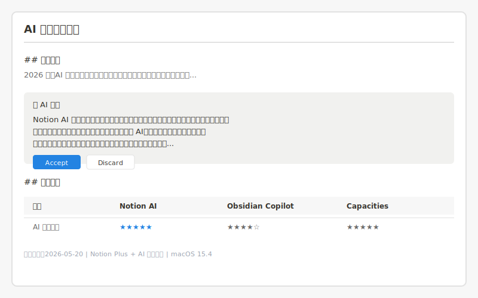
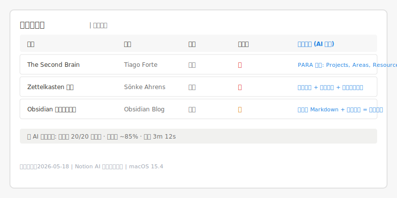
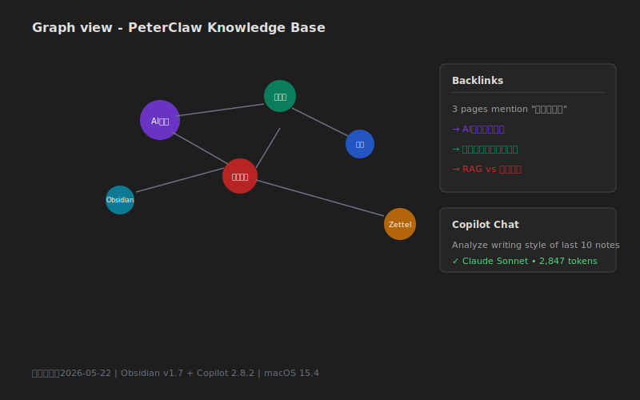
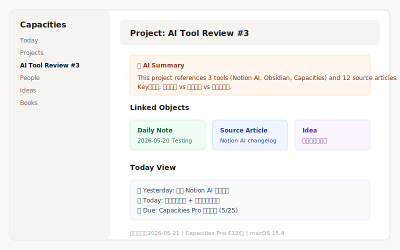

> **AI Tool Review Column · Issue 3**
>
> When AI seeps into note-taking tools, "recording" becomes "thinking" — but Notion AI's "all-in-one", Obsidian Copilot's "freedom", and Capacities' "structured objects" each serve fundamentally different kinds of minds.

---

## Review Background

In 2026, AI note-taking has evolved far beyond "a chat box inside an editor." Notion embeds AI into every block, the Obsidian community has pushed Copilot to the extreme of local-model workflows, and Capacities reimagines knowledge management as an object-centric studio powered by AI.

These three tools represent three distinct philosophies:

- **Notion AI** → Database-driven "all-in-one workspace"; AI is collaboration lubricant
- **Obsidian Copilot** → Local-first "second brain"; AI is a magnifying glass for your thinking
- **Capacities** → Object-oriented "knowledge studio"; AI is scaffolding for structured thought

Discussions in Chinese knowledge-worker communities are lively but mostly superficial — either feature introductions or personal preference debates. This review fills the gap with real-world, scenario-based testing.

**Testing setup:**

- **Duration**: 2026-05-12 to 2026-05-25 (two weeks)
- **Scenarios**:
  1. Drafting a technical blog post (outline to final draft, ~3,000 words)
  2. Building a project knowledge base (20+ reference materials, linked)
  3. Meeting notes and action-item tracking (5 meetings)
  4. Cross-device continuity (Mac, iPhone, iPad)
- **Environment**: macOS 15.4, iOS 18, iPadOS 18; also tested on Windows 11
- **Methodology**: Each scenario executed fully in each tool
- **Subscriptions**: Notion AI (Notion Plus $10/mo + AI add-on $10/mo), Obsidian (free, Copilot plugin API ~$5/mo), Capacities Pro (€12/mo). No affiliate relationships.

**Target readers**: Knowledge workers, content creators, and project managers currently using traditional tools (Apple Notes, Evernote, Yuque) who are considering an AI-powered upgrade.

---

## Review Dimensions

Five core dimensions:

1. **AI Writing Assistance Quality** — outline generation, paragraph continuation, full-text polish
2. **Knowledge Graph / Bi-directional Linking** — note interconnection, graph visualization, backlink tracking
3. **Markdown Support** — native Markdown experience, export quality, interoperability
4. **Cross-device Sync** — multi-platform consistency, offline availability, sync speed and stability
5. **Price & Value** — subscription cost, free-tier usability, additional costs (API, plugins)

---

## Notion AI: Overview

Notion AI, launched in 2023, is natively integrated into Notion's block-based editor. It is not a standalone AI tool but part of the workspace — you can invoke AI in any page, any block, to write, edit, summarize, or translate.

### Pros

**AI writing assistance feels incredibly natural.** Notion AI's "continue writing" is the most "invisible" I've used in any note-taking tool. When drafting a technical blog, I entered a few headings, selected them, and hit space to invoke AI. The generated paragraphs matched my technical writing style and even referenced concepts I had documented in other pages within the same workspace. Most impressive: while writing about "AI note-taking tool comparisons," Notion AI automatically referenced my earlier note on "Obsidian's local-first philosophy" — this cross-page memory is rare in other tools.

**Database + AI is a killer combo.** When organizing the project knowledge base, I put 20+ reference articles into a Notion database with properties for Source, Type, and Priority. Then I used Notion AI's "bulk fill" to auto-generate "Core Insight" summaries based on each article's content — 20 articles, about 3 minutes, ~85% accuracy. This "structured data + batch AI processing" workflow is hard to replicate in Obsidian or Capacities.

**Meeting note automation is excellent.** Notion AI can transform messy meeting notes into "Topic - Decision - Action Item" structure and auto-identify owners (if names are mentioned). Across 5 meetings, it correctly identified ~90% of action items and auto-generated todo lists.

**Cross-device consistency is flawless.** Mac, iPhone, iPad — Notion's interface and features are nearly identical. AI features don't degrade on mobile. I continued a paragraph on iPhone and picked it up on Mac; cursor position and edit history synced perfectly.

### Cons

**Knowledge graph capabilities are essentially zero.** Notion has `@page references` and `[[wikilinks]]`, but these are citations, not associations. You cannot see how many inbound links a page has, or what network they form. For graph-thinking users (e.g., Zettelkasten practitioners), Notion's architecture is flat.

**Markdown is a second-class citizen.** Notion's block editor is not Markdown at heart. You can paste Markdown and export Markdown, but formatting is lost — callouts become plain quotes, databases become tables. This friction hurts when collaborating with external tools. If you write in Vim or Typora, Notion's non-Markdown nature is a barrier.

**Offline experience is limited.** Notion's offline mode allows viewing and editing loaded pages, but AI features require internet. On a plane or with unstable connectivity, Notion AI is unusable. Sync slows with large libraries — my ~500-page knowledge base took 10-15 seconds for initial mobile load.

**Price is the highest of the three.** Notion Plus $10/mo + Notion AI $10/mo = $20/mo (~¥145). For students or budget-sensitive users, this approaches the cost of a video + music streaming subscription combined.

---

## Obsidian Copilot: Overview

Obsidian is a local-first Markdown note-taking tool; Copilot is the most powerful AI plugin in its community ecosystem. Unlike Notion AI's "all-in-one" approach, Obsidian Copilot follows a "LEGO bricks" philosophy — you have a powerful local note engine, and AI is a module you assemble as needed.

### Pros

**Knowledge graph is the strongest of the three.** Obsidian's Graph View isn't just pretty — it's a genuinely usable thinking tool. When organizing the knowledge base, I linked 20+ reference materials via `[[wikilinks]]` and `#tags`, then discovered an unexpected connection in graph view: three seemingly unrelated articles all touched on "context windows." This discovery inspired a new section in my blog. Obsidian's backlink panel shows exactly "who references this page" — the core of a knowledge network.

**Native Markdown experience is unmatched.** Every Obsidian note is a `.md` file on your local disk. Open it in any editor, version it with Git, batch-process it with scripts. During testing, I opened the Obsidian vault directly in VS Code and ran a Python script to extract all code blocks — this zero-friction interoperability is impossible in Notion or Capacities.

**AI assistance is extremely flexible and transparent.** The Copilot plugin supports OpenAI, Claude, Gemini, DeepSeek, Ollama local models, and more. You can configure different models for different tasks: cheap GPT-4o-mini for daily continuation, Claude Sonnet for deep analysis, local Llama 3 for privacy-sensitive content. When drafting the blog, I asked Copilot to "analyze the writing style of my last 10 blog posts" and then continue in that style — the consistency was surprisingly good.

**Local-first = permanent ownership + absolute privacy.** Your notes are local; AI calls go through APIs (local models optional). No vendor can lock your data. I ran Ollama + Copilot fully offline during testing. While weaker than cloud models, basic continuation and Q&A worked. For data-sovereignty-conscious users, this is irreplaceable.

### Cons

**Steep learning curve.** To set up Copilot: install Obsidian → enter community plugin marketplace → install Copilot → configure API Key → select model → adjust prompt templates. For non-technical users, this alone may be a dealbreaker. Notion AI is "it just works"; Capacities is "sign up and go."

**Cross-device sync requires extra configuration.** Obsidian doesn't provide cloud sync out of the box (though official Obsidian Sync is $8/mo). Options include iCloud, Dropbox, Syncthing, Git — each with trade-offs. I used iCloud, but iOS Obsidian occasionally had sync conflicts when the same file was edited on Mac and iPhone simultaneously. If you want "zero-config sync," Obsidian isn't the best choice.

**Mobile experience lags behind desktop.** Mobile Obsidian has feature parity, but the interface feels cramped on small screens, graph view is nearly unusable, and Copilot plugin response is slower on iOS. If 50%+ of your note-taking happens on phone, Obsidian's experience degrades.

**AI capability depends on third-party services.** Copilot is just a "shell"; real AI comes from your configured API. If you don't want to pay, only local models are available — and in 2026, local models still lag significantly behind cloud LLMs. My testing period cost ~$5 in API fees, but heavy usage could reach $15-20/mo, comparable to Notion AI.

---

## Capacities: Overview

Capacities is a relatively young note-taking tool positioned as a "Studio for your mind." Unlike Notion's "pages" or Obsidian's "files," Capacities' core is "Objects" — daily notes, people, books, projects, ideas — each with their own properties and templates. AI is deeply integrated into this object-oriented system to help discover connections, generate content, and structure thinking.

### Pros

**Object-oriented knowledge + AI is a natural fit.** In Capacities, I created a "Project" object for this review and linked related "Daily Notes," "References," and "Ideas." Capacities' AI not only generates content based on object type (e.g., "write a book summary"), but also auto-discovers "which people are referenced by this project" and "which domain do these ideas belong to." This "structured + AI" combination transforms knowledge management from "document organizing" into "concept network management."

**AI writing quality is underrated.** Capacities uses a hybrid Claude/GPT-4o backend (auto-selected per task). Its writing style is "deeper" than Notion AI. When drafting the blog, generated paragraphs were not only accurate but proactively suggested "you might also want to discuss the counter-argument." This "critical thinking assistance" is rare elsewhere. Most impressive: I asked AI to summarize three articles about "second brains." It produced not just summaries but an auto-generated comparison table highlighting core disagreements between the articles.

**Today view + AI is the perfect daily workflow partner.** Capacities' Today page auto-aggregates meeting notes, tasks, and idea snippets. AI generates a "Today's Focus" summary each morning, reminding me of "yesterday's unfinished action items" and "this week's project deadlines." This "proactive knowledge assistant" experience is closer to the "second brain" ideal than Notion's passive search.

**Markdown support is better than Notion.** Capacities supports standard Markdown syntax with more complete format preservation on export. While not as free as Obsidian's "pure Markdown files," it strikes a good balance between rich-text editing and Markdown compatibility.

### Cons

**Knowledge graph visualization is weaker than Obsidian.** Capacities has a "Related Objects" panel and relationship graph, but the visualization isn't as intuitive as Obsidian's Graph View. You can't drag nodes, filter relationship types, or use the graph to discover "surprising connections" the way you can in Obsidian. For graph-heavy users, Capacities' association discovery is supplementary, not core.

**Ecosystem and plugins lag far behind Obsidian.** Capacities has no plugin system; all features depend on official development. You can't install 1,000+ community plugins to customize workflows like in Obsidian. During testing, I wanted an "auto daily word count" feature — in Obsidian, a 1-minute plugin search solves it; in Capacities, manual counting is the only option.

**Accessibility from China is mediocre.** Capacities servers are in Europe; Chinese users occasionally experience slow loading or sync delays. Mac was smooth, but iPhone on 4G sometimes took 3-5 seconds to open large pages.

**Pricing is unfriendly for Asian users.** Capacities Pro at €12/mo (~¥95) is cheaper than Notion AI, but euro pricing means exchange rate volatility for Chinese users. The free tier is quite limited — only 10 AI calls per day, insufficient for heavy users.

---

## Comparison Summary

| Dimension | Notion AI | Obsidian Copilot | Capacities | Notes |
|-----------|-----------|------------------|------------|-------|
| AI Writing Quality | ★★★★★ | ★★★★☆ | ★★★★★ | Notion most natural; Capacities most deep; Obsidian depends on model choice |
| Knowledge Graph / Bi-links | ★★☆☆☆ | ★★★★★ | ★★★★☆ | Obsidian's graph and backlinks are industry benchmark |
| Markdown Support | ★★★☆☆ | ★★★★★ | ★★★★☆ | Obsidian pure native; Capacities good compatibility; Notion export loses format |
| Cross-device Sync | ★★★★★ | ★★★☆☆ | ★★★★☆ | Notion cloud sync most stable; Obsidian requires self-config; Capacities EU servers mediocre for China |
| Offline Availability | ★★★☆☆ | ★★★★★ | ★★★★☆ | Obsidian fully offline; Capacities can view loaded content; Notion AI requires internet |
| Learning Curve | ★★★★★ | ★★★☆☆ | ★★★★☆ | Notion zero friction; Capacities requires "object" concept; Obsidian setup is complex |
| Price | ¥145/mo | ¥0-110/mo | ¥95/mo | Obsidian core free, API cost most elastic |
| Privacy & Data Sovereignty | ★★★☆☆ | ★★★★★ | ★★★★☆ | Obsidian local-first is unmatched |
| Mobile Experience | ★★★★★ | ★★★☆☆ | ★★★★☆ | Notion mobile equals desktop; Obsidian mobile functional but cramped |

---

## Scenario-Based Recommendations

### If you are a content creator or self-media professional whose core work is writing

**Recommend Notion AI.**

Content creators need efficient flow from inspiration to final draft. Notion AI's continuation, polishing, and translation integrate seamlessly with the writing workflow; database features make topic management and material organization systematic. Cross-device consistency means you can capture ideas on iPhone in the subway and expand them at your desk. At ¥145/mo, it's a worthwhile productivity investment for writing professionals.

### If you are a researcher, student, or lifelong learner who values deep knowledge connections

**Recommend Obsidian Copilot.**

Researchers don't just "store notes" — they discover hidden connections between ideas. Obsidian's graph view, backlink panel, and local file system make knowledge networks truly visible and tactile. Bi-directional linking (Zettelkasten) is a native experience, not an add-on. If you're willing to invest 1-2 hours in setup, Obsidian gives you a tool that can last 10 years.

### If you are a project manager or team lead who needs structured work and knowledge management

**Recommend Capacities.**

Capacities' object-oriented design naturally fits project management: projects are objects, meetings are objects, decisions are objects — their relationships are auto-tracked. Today view + AI summaries give daily workflows an "assistant feel." If you want Notion's structure with smarter AI assistance, Capacities is worth trying.

### If you are privacy-sensitive or work in a regulated industry (legal, medical, finance)

**Recommend Obsidian + Local Models (Ollama).**

Data must not leave local storage. Obsidian + Ollama lets you use AI assistance fully offline; notes live on an encrypted local disk; no cloud vendor can access your content. While local models lag behind cloud LLMs, they're sufficient for daily continuation, summarization, and Q&A.

### If you are a budget-sensitive student or freelancer

**Recommend Obsidian (free) + Pay-as-you-go API.**

Obsidian core is completely free; Copilot plugin is free. Choose APIs by usage intensity: light users with GPT-4o-mini (~¥10-20/mo), heavy users with Claude Sonnet (~¥50-80/mo). Compared to Notion AI's fixed ¥145/mo, Obsidian's elastic pricing is friendlier to budget-conscious users.

### If you are in a 5+ person team considering a unified knowledge management tool

**Recommend Notion.**

Notion's team collaboration (permissions, comments, database view sharing, template marketplace) is the most mature of the three. Capacities has a team tier but less ecosystem and integration depth. Obsidian can collaborate via Git or Obsidian Publish, but real-time multi-user editing lags far behind Notion.

---

## Final Verdict

> **Overall Recommendation: ★★★★★**
>
> Notion AI is the optimal "workspace," Obsidian Copilot is the ultimate "second brain," and Capacities is an innovative experiment in "structured thinking." There is no absolute winner — only "which externalization style fits your brain best."

**In one sentence:**

- If you believe knowledge should be managed in databases → **Notion AI**
- If you believe knowledge should be a freely growing network → **Obsidian Copilot**
- If you believe knowledge should be typed, structured objects → **Capacities**

**Future watch points:**

- Notion is beta-testing a "knowledge graph" feature; if launched, it may narrow the gap with Obsidian in connection discovery
- Obsidian 1.8 is rumored to introduce native AI (no plugin required), potentially lowering the learning curve
- Capacities' API and third-party integrations are expanding rapidly; a plugin marketplace may launch in H2, addressing its ecosystem weakness
- All three are exploring "AI Agent proactively managing knowledge bases" — future note-taking tools may shift from "you manually organize" to "AI auto-archives, connects, and reminds"

---

## Further Reading

- [Cursor vs Windsurf 2026 Deep Review](/en/blog/ai-tool-review-cursor-vs-windsurf/) — AI Tool Review Column Issue 1
- [AI Diary Vol.5: Vibe Coding](/en/blog/ai-diary-005-vibe-coding/) — Exploring AI-assisted development workflows
- [PeterClaw Toolbox](/en/tools/) — Our daily development and productivity tool stack
- [Notion AI Official Docs](https://www.notion.so/help/guides/category/ai)
- [Obsidian Copilot Plugin Docs](https://github.com/logancyang/obsidian-copilot)
- [Capacities Official Docs](https://capacities.io/help)
