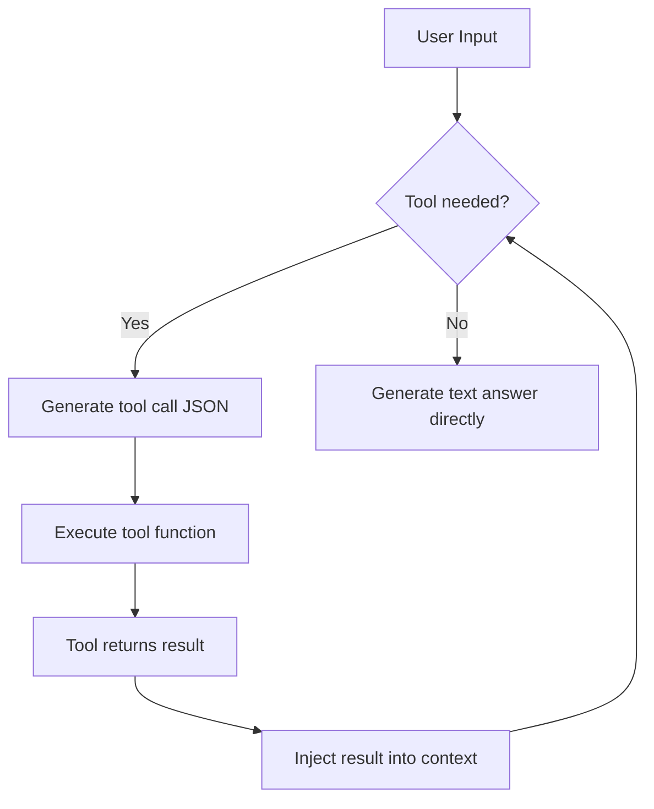
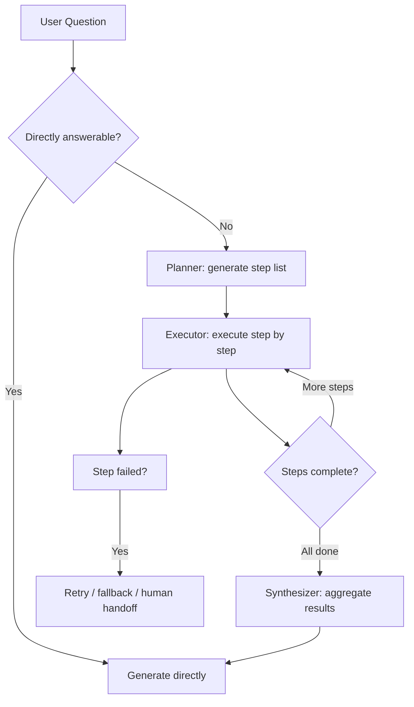
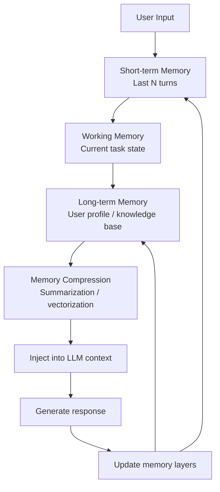

> **Target audience**: Developers building AI Agent systems, familiar with Python and LLM APIs.
>
> This article complements [AI Agent Workflow Design Patterns](/en/knowledge/ai-agent-workflow-patterns/) — while that piece focuses on "how multiple agents collaborate," this one focuses on "how a single agent thinks and acts internally."

---

## Introduction: Why an Agent Is More Than "Prompt + API Call"

Since 2025, AI Agents have evolved rapidly from demo concepts to engineering infrastructure. But there is a significant architectural gap between "asking an LLM a question" and "having an Agent autonomously complete a task."

An Agent capable of autonomous task completion needs at least four capability modules:

1. **Knowledge acquisition** — knowing where to find information (RAG)
2. **Tool use** — knowing how to invoke external systems (Function Calling)
3. **Reasoning and planning** — knowing how to break down complex tasks into steps (Multi-step Reasoning)
4. **Memory management** — knowing what to remember and what to forget (Memory)

These four modules correspond to four design patterns. This article breaks down each pattern's architecture, code implementation, and real-world pitfalls.

---

## Pattern 1: RAG (Retrieval-Augmented Generation)

### When to Use

| Scenario | Example |
|----------|---------|
| Knowledge base Q&A | Customer service bot querying product docs |
| Long document analysis | Legal contract review, research paper synthesis |
| Real-time information augmentation | Answering time-sensitive questions with latest news |
| Private data queries | Enterprise knowledge bases, personal note retrieval |

**Signal to avoid RAG**: The task can be answered entirely from the model's pretrained knowledge, with no need to cite specific sources.

### Core Architecture


### Core Code Snippets

**1. Document Chunking and Embedding**

```python
from langchain.text_splitter import RecursiveCharacterTextSplitter
from langchain_community.vectorstores import Chroma
from langchain_openai import OpenAIEmbeddings

# Chunking strategy: recursively split at semantic boundaries
text_splitter = RecursiveCharacterTextSplitter(
    chunk_size=512,
    chunk_overlap=128,
    separators=["\n\n", "\n", ".", " ", ""]
)
chunks = text_splitter.split_documents(documents)

# Write to vector store
vectorstore = Chroma.from_documents(
    documents=chunks,
    embedding=OpenAIEmbeddings(model="text-embedding-3-small"),
    persist_directory="./chroma_db"
)
```

**2. Retrieval + Reranking + Generation**

```python
from langchain.retrievers import ContextualCompressionRetriever
from langchain.retrievers.document_compressors import CrossEncoderReranker
from langchain_community.cross_encoders import HuggingFaceCrossEncoder

# Base retriever: recall 20 candidates
base_retriever = vectorstore.as_retriever(search_kwargs={"k": 20})

# Reranking: use lightweight cross-encoder to filter Top-5
compressor = CrossEncoderReranker(
    model=HuggingFaceCrossEncoder("BAAI/bge-reranker-base"),
    top_n=5
)
retriever = ContextualCompressionRetriever(
    base_compressor=compressor,
    base_retriever=base_retriever
)

# Force source citations during generation
context_docs = retriever.invoke(query)
context_text = "\n\n".join([
    f"[Source {i+1}] {doc.page_content}"
    for i, doc in enumerate(context_docs)
])

prompt = f"""Answer the user's question based on the following context.
If the context is insufficient, state so explicitly.
You must cite sources using [Source N] in your answer.

Context:
{context_text}

User question: {query}
"""
response = llm.invoke(prompt)
```

### Common Pitfalls

| Pitfall | Symptom | Fix |
|---------|---------|-----|
| **Wrong chunk size** | 512-token chunks split table rows, resulting in semantically incomplete chunks | Split at structural boundaries (Markdown headers, HTML tags); keep tables intact |
| **Retrieval-generation misalignment** | Retrieved documents are topically relevant but lack the specific field needed to answer | Pre-store structured tags in chunk metadata (e.g., `product:Pro`, `type:pricing`) and filter by metadata during retrieval |
| **Vector hallucination** | High cosine similarity but semantically unrelated documents get recalled | Always add a reranking layer; vector similarity alone is unreliable |
| **Context overflow** | Top-5 documents exceed the model's context window | Summarize or compress long documents, or limit `max_token_per_doc` at the retrieval layer |
| **Missing citations** | Model hallucinates answers that users cannot verify | Force source numbering in the prompt and validate citation IDs in post-processing |

> **Production tip**: Don't self-host vector databases for production. Managed services like Pinecone, Qdrant Cloud, and Weaviate Cloud are far more mature in consistency, monitoring, and multi-tenancy than local Chroma. Chroma is great for prototyping, not for production.

---

## Pattern 2: Function Calling / Tool Use

### When to Use

| Scenario | Example |
|----------|---------|
| Needs real-time data | Weather queries, stock prices, flight status |
| Needs to execute actions | Send email, create calendar events, submit tickets |
| Needs precise calculation | Math operations, data analysis (LLMs struggle with 3-digit multiplication) |
| Needs external system interaction | Call internal APIs, operate databases, read/write files |

**Signal to avoid Function Calling**: The task only requires text generation, with no external state changes or real-time data queries.

### Core Architecture



### Core Code Snippets

**1. Tool Definition (OpenAI format)**

```python
tools = [
    {
        "type": "function",
        "function": {
            "name": "search_products",
            "description": "Query product list by filter criteria",
            "parameters": {
                "type": "object",
                "properties": {
                    "category": {
                        "type": "string",
                        "enum": ["electronics", "clothing", "books"],
                        "description": "Product category"
                    },
                    "max_price": {
                        "type": "number",
                        "description": "Maximum price in CNY"
                    },
                    "keyword": {
                        "type": "string",
                        "description": "Search keyword"
                    }
                },
                "required": ["category"]
            }
        }
    },
    {
        "type": "function",
        "function": {
            "name": "calculate_shipping",
            "description": "Calculate shipping cost",
            "parameters": {
                "type": "object",
                "properties": {
                    "weight_kg": {"type": "number"},
                    "destination_city": {"type": "string"}
                },
                "required": ["weight_kg", "destination_city"]
            }
        }
    }
]
```

**2. Tool Execution Loop**

```python
import json
from openai import OpenAI

client = OpenAI()

messages = [{"role": "user", "content": "Find electronics under 500 CNY, something lightweight"}]

# Core loop: LLM decides whether to call tools or answer directly
for _ in range(5):  # Max 5 tool call rounds to prevent infinite loops
    response = client.chat.completions.create(
        model="gpt-4o",
        messages=messages,
        tools=tools,
        tool_choice="auto"
    )
    
    message = response.choices[0].message
    messages.append(message)
    
    # If no tool calls needed, return directly
    if not message.tool_calls:
        print(message.content)
        break
    
    # Execute all requested tool calls
    for tool_call in message.tool_calls:
        function_name = tool_call.function.name
        arguments = json.loads(tool_call.function.arguments)
        
        # Route to actual function
        if function_name == "search_products":
            result = search_products(**arguments)
        elif function_name == "calculate_shipping":
            result = calculate_shipping(**arguments)
        else:
            result = {"error": f"Unknown function: {function_name}"}
        
        # Inject tool result into context
        messages.append({
            "role": "tool",
            "tool_call_id": tool_call.id,
            "content": json.dumps(result, ensure_ascii=False)
        })
else:
    print("Max tool call rounds reached, forcing termination")
```

**3. Safety Wrapper: Tool Function Decorator**

```python
from functools import wraps
from typing import Any

class ToolError(Exception):
    pass

def safe_tool(max_retries=1):
    """Tool function safety decorator: catch exceptions, normalize return values"""
    def decorator(func):
        @wraps(func)
        def wrapper(*args, **kwargs):
            try:
                result = func(*args, **kwargs)
                # Normalize: ensure dict return that is JSON-serializable
                if not isinstance(result, dict):
                    return {"result": result}
                return result
            except ToolError as e:
                return {"error": str(e)}
            except Exception as e:
                return {"error": f"Tool execution error: {type(e).__name__}: {str(e)}"}
        return wrapper
    return decorator

@safe_tool(max_retries=1)
def search_products(category: str, max_price: float = None, keyword: str = None) -> dict:
    """Query product list"""
    if max_price is not None and max_price < 0:
        raise ToolError("Price cannot be negative")
    # ... actual query logic
    return {"products": [...], "total": 42}
```

### Common Pitfalls

| Pitfall | Symptom | Fix |
|---------|---------|-----|
| **Unclear descriptions** | LLM doesn't call tools when it should, or passes wrong parameters | `description` must clearly state "when to call" and "semantics of each parameter". Test: give the schema to another LLM and see if it judges call timing correctly |
| **Infinite loops** | Agent repeatedly calls the same tool, getting stuck | Set max rounds (e.g., 5), and add system prompt instruction: "if the previous tool returned no new information, do not call it again" |
| **Parameter injection** | User input is concatenated into tool parameters, causing SQL injection or command execution | All tool parameters must be validated and escaped; sensitive operations (write data, send email) require secondary confirmation |
| **Hallucinated calls** | LLM requests a non-existent tool or invents parameters | Strictly validate `function_name` against an allowlist at the code layer; validate parameters with Pydantic |
| **Error leakage** | Internal tool exception details are exposed to users | Decorator catches exceptions and returns normalized error messages; original stack traces go only to logs |

> **Production tip**: When tool count exceeds 10, LLM selection accuracy drops significantly. Solutions: (1) Group by domain, do intent classification first, then inject only tools from that domain; (2) Add `category` tags to each tool and have the LLM select category first, then tool.

---

## Pattern 3: Multi-step Reasoning

### When to Use

| Scenario | Example |
|----------|---------|
| Complex problem decomposition | "Analyze this company's financial reports for the past three years and give investment advice" |
| Multi-constraint queries | "Find a flight from Beijing to Tokyo, departing Friday, under 3000 CNY, with free cancellation" |
| External validation needed | "Generate code → run tests → fix based on errors → test again" |
| Information completion | "User only said 'that issue from last time'; need to find context from memory first" |

**Signal to avoid Multi-step**: The question can be answered with a single LLM call, with no external dependencies or intermediate validation steps.

### Core Architecture



### Core Code Snippets

**1. ReAct Pattern (Reasoning + Acting)**

```python
from typing import TypedDict, List, Union

class ThoughtAction(TypedDict):
    thought: str
    action: str
    action_input: dict
    observation: Union[str, None]

class ReActAgent:
    def __init__(self, llm, tools, max_steps=10):
        self.llm = llm
        self.tools = {t["function"]["name"]: t for t in tools}
        self.max_steps = max_steps
    
    def run(self, query: str) -> str:
        scratchpad = f"Question: {query}\n\n"
        
        for step in range(self.max_steps):
            prompt = self._build_react_prompt(scratchpad)
            response = self.llm.invoke(prompt)
            
            parsed = self._parse_response(response)
            scratchpad += f"Thought {step+1}: {parsed['thought']}\n"
            
            if parsed["action"] == "finish":
                return parsed["action_input"].get("answer", "")
            
            tool_result = self._execute_tool(
                parsed["action"],
                parsed["action_input"]
            )
            scratchpad += f"Action: {parsed['action']}({parsed['action_input']})\n"
            scratchpad += f"Observation: {tool_result}\n\n"
        
        return "Max step limit reached, reasoning incomplete."
    
    def _build_react_prompt(self, scratchpad: str) -> str:
        tool_desc = "\n".join([
            f"- {name}: {t['function']['description']}"
            for name, t in self.tools.items()
        ])
        return f"""You are a reasoning assistant. Think and act in this format:

Available tools:
{tool_desc}

Format requirements:
Thought: [your reasoning]
Action: [tool name] or finish
Action Input: [JSON parameters]

{scratchpad}
Thought:"""
    
    def _parse_response(self, response: str) -> ThoughtAction:
        # Simplified parser; production should use structured output
        ...
    
    def _execute_tool(self, name: str, inputs: dict) -> str:
        if name not in self.tools:
            return f"Error: tool {name} does not exist"
        # Actual tool invocation...
```

**2. Plan-and-Execute**

```python
from pydantic import BaseModel

class Step(BaseModel):
    step_number: int
    description: str
    tool: str | None
    tool_input: dict
    expected_output: str

class Plan(BaseModel):
    steps: List[Step]
    estimated_completion: str

def plan_and_execute(query: str, planner_llm, executor_llm, tools) -> str:
    # Phase 1: Planning
    plan = planner_llm.invoke(
        f"Break down the following problem into executable steps, return structured Plan:\n{query}",
        response_format=Plan
    )
    
    # Phase 2: Execution (steps can be parallel or serial)
    results = []
    for step in plan.steps:
        if step.tool:
            tool_args = step.tool_input
            tool_fn = tools[step.tool]
            result = tool_fn(**tool_args)
        else:
            result = executor_llm.invoke(step.description)
        results.append({"step": step.step_number, "result": result})
    
    # Phase 3: Synthesis
    summary = executor_llm.invoke(
        f"Based on the following execution results, provide the final answer:\n{results}"
    )
    return summary
```

**3. Chain-of-Verification**

```python
def chain_of_verification(query: str, llm, verifier) -> str:
    """Draft first, verify each claim, then revise"""
    
    # Step 1: Generate initial answer
    draft = llm.invoke(f"Answer the following question: {query}")
    
    # Step 2: Extract verifiable claims
    claims_prompt = f"""Extract all factual claims from the following answer, one per line:
{draft}"""
    claims = llm.invoke(claims_prompt).strip().split("\n")
    
    # Step 3: Verify each claim
    verified = []
    for claim in claims:
        if not claim.strip():
            continue
        evidence = verifier.search(claim)
        is_correct = llm.invoke(
            f"Claim: {claim}\nEvidence: {evidence}\nIs this claim correct? Yes/No/Uncertain"
        )
        verified.append({"claim": claim, "correct": is_correct, "evidence": evidence})
    
    # Step 4: Generate revised answer
    final = llm.invoke(
        f"Based on the following verification results, rewrite the answer (fix errors, keep correct info):\n{verified}"
    )
    return final
```

### Common Pitfalls

| Pitfall | Symptom | Fix |
|---------|---------|-----|
| **Over-ambitious planning** | Agent generates a 20-step plan but drifts off-target by step 3 | Limit step granularity (completable within 15 minutes); add "goal consistency check" after each step |
| **Intermediate result pollution** | A tool returns incorrect data, and subsequent steps reason on top of it | Add "result confidence assessment" after each step; trigger fallback or retry for low-confidence results |
| **Circular dependencies** | Step B depends on Step A, but Step A's output format doesn't match Step B's expectation | Define input/output schemas for each step during planning; enforce strict type validation during execution |
| **Cost explosion** | Multi-step reasoning consumes massive tokens, exceeding budget per query | Use different models for planner (strong) and executor (lightweight) |
| **Uninterruptible execution** | User wants to change requirements mid-way, but Agent continues with the original plan | Check for new user input before each step; support "interrupt-replan" |

> **Production tip**: Don't jump straight to the most complex ReAct. Evaluate problem complexity first:
> - L1 Simple (single call sufficient) → direct LLM call
> - L2 Medium (2-3 deterministic steps) → Plan-and-Execute with pre-generated plan
> - L3 Complex (uncertain flow, needs trial-and-error) → ReAct with dynamic next-step decisions

---

## Pattern 4: Memory Management

### When to Use

| Scenario | Memory Type Needed |
|----------|-------------------|
| Multi-turn conversation context | Short-term memory (conversation history) |
| User preference learning (common addresses, language preference) | Long-term memory (user profile) |
| Intermediate state of complex tasks | Working memory (current task context) |
| Cross-session continuous learning | Long-term memory + compression/summarization |

### Core Architecture



### Core Code Snippets

**1. Layered Memory Implementation**

```python
from typing import List, Dict, Optional
from dataclasses import dataclass, field
from datetime import datetime

@dataclass
class MemoryLayer:
    max_tokens: int
    entries: List[dict] = field(default_factory=list)
    
    def add(self, entry: dict) -> None:
        self.entries.append({
            **entry,
            "timestamp": datetime.now().isoformat()
        })
        self._compress_if_needed()
    
    def get_context(self, query: Optional[str] = None) -> str:
        raise NotImplementedError
    
    def _compress_if_needed(self):
        raise NotImplementedError

class ShortTermMemory(MemoryLayer):
    def __init__(self, max_turns: int = 10):
        super().__init__(max_tokens=4000)
        self.max_turns = max_turns
    
    def add(self, role: str, content: str):
        super().add({"role": role, "content": content})
        self.entries = self.entries[-self.max_turns:]
    
    def get_context(self, query=None) -> List[dict]:
        return [{"role": e["role"], "content": e["content"]}
                for e in self.entries]
    
    def _compress_if_needed(self):
        pass

class WorkingMemory(MemoryLayer):
    def __init__(self):
        super().__init__(max_tokens=2000)
        self.facts: Dict[str, str] = {}
    
    def set_fact(self, key: str, value: str):
        self.facts[key] = value
    
    def get_fact(self, key: str) -> Optional[str]:
        return self.facts.get(key)
    
    def get_context(self, query=None) -> str:
        lines = ["[Current Task State]"]
        for k, v in self.facts.items():
            lines.append(f"- {k}: {v}")
        return "\n".join(lines)
    
    def _compress_if_needed(self):
        pass

class LongTermMemory(MemoryLayer):
    def __init__(self, user_id: str, vector_store):
        super().__init__(max_tokens=3000)
        self.user_id = user_id
        self.vector_store = vector_store
        self.profile: Dict = self._load_profile()
    
    def add(self, summary: str, metadata: dict = None):
        super().add({"summary": summary, "metadata": metadata or {}})
        self.vector_store.add_texts([summary], metadatas=[metadata])
    
    def get_context(self, query: str) -> str:
        docs = self.vector_store.similarity_search(query, k=3)
        memories = [d.page_content for d in docs]
        
        lines = ["[User Profile]"]
        for k, v in self.profile.items():
            lines.append(f"- {k}: {v}")
        lines.append("\n[Relevant History]")
        for i, m in enumerate(memories, 1):
            lines.append(f"{i}. {m}")
        return "\n".join(lines)
    
    def _load_profile(self) -> Dict:
        return {"language": "en", "timezone": "America/New_York"}
    
    def _compress_if_needed(self):
        pass
```

**2. Memory Injection and Context Assembly**

```python
class AgentWithMemory:
    def __init__(self, llm, vector_store):
        self.llm = llm
        self.short_term = ShortTermMemory(max_turns=10)
        self.working = WorkingMemory()
        self.long_term = LongTermMemory("user_001", vector_store)
    
    def chat(self, user_input: str) -> str:
        self.short_term.add("user", user_input)
        
        messages = [
            {"role": "system", "content": "You are a helpful assistant."},
            {"role": "system", "content": self.long_term.get_context(user_input)},
            {"role": "system", "content": self.working.get_context()},
        ]
        messages.extend(self.short_term.get_context())
        
        response = self.llm.invoke(messages)
        self.short_term.add("assistant", response)
        
        if "my email is" in user_input.lower():
            email = self._extract_email(user_input)
            self.working.set_fact("user_email", email)
        
        return response
```

**3. Memory Summarization and Compression**

```python
def summarize_conversation(history: List[dict], llm) -> str:
    conversation = "\n".join([
        f"{e['role']}: {e['content']}" for e in history
    ])
    
    prompt = f"""Compress the following conversation into a structured summary.
Preserve:
1. User's explicitly stated needs and preferences
2. Confirmed key facts (addresses, times, preference settings, etc.)
3. Unfinished to-do items
4. Important emotional signals

Conversation:
{conversation}

Summary:"""
    return llm.invoke(prompt)

# Usage: when short-term memory exceeds max_turns, summarize old turns into long-term memory
old_turns = short_term.entries[:5]
summary = summarize_conversation(old_turns, llm)
long_term.add(summary, metadata={"type": "conversation_summary", "date": "2026-05-26"})
```

### Common Pitfalls

| Pitfall | Symptom | Fix |
|---------|---------|-----|
| **Memory bloat** | Long-term memory grows indefinitely, retrieving irrelevant old information per query | Add TTL (time-to-live) to memory entries; clean up periodically; apply time-decay weighting during retrieval |
| **Memory pollution** | Incorrect information gets remembered and continuously influences future answers | Add "confidence score" tags to each memory entry; exclude low-confidence memories from retrieval |
| **Context truncation** | Three memory layers combined exceed model context window | Count tokens per layer; truncate by priority (working > short-term > long-term) |
| **Privacy leakage** | User A's memory is injected into User B's context | Strict user ID isolation; vector stores must use per-user namespaces in multi-tenant architectures |
| **Failure to forget** | User explicitly requests deletion, but vector embeddings still linger | Delete both original records and vector embeddings; run consistency checks after deletion |

> **Production tip**: Don't over-engineer memory systems. Most applications work well with "last 10 conversation turns + a user preference dict". Vector-based long-term memory is only necessary for (1) cross-session scenarios, or (2) when large history needs to be retrieved. Start simple and add vector stores only when you have a clear pain point.

---

## Summary: Four Patterns Cheat Sheet

| Pattern | Problem Solved | Core Components | Keywords |
|---------|---------------|-----------------|----------|
| **RAG** | LLM knowledge gaps / outdated info | Vector store + reranker + cited generation | Knowledge base, document Q&A, private data |
| **Function Calling** | LLM cannot directly execute actions | Tool schema + execution loop + safety checks | Real-time data, external APIs, state changes |
| **Multi-step Reasoning** | Complex problems can't be solved in one shot | Planner + executor + verifier | Decomposition, reasoning chains, self-correction |
| **Memory** | Context loss, no personalization | Short-term / working / long-term + compression | Multi-turn dialogue, user profiles, cross-session |

### Combined Usage Example

A complete Agent often needs multiple patterns working together:

```
User: "That Japan travel plan I asked about last week — now check
      Shinkansen schedules from Tokyo to Osaka on June 15,
      keep it under 20,000 yen."

Agent internal flow:
1. Memory → Retrieve "Japan travel plan" context from long-term memory
2. Memory → Confirm user preferences (budget-friendly, early trains)
3. Function Calling → Call Shinkansen query tool
4. Multi-step → If direct trains exceed budget, plan "local + express" combo
5. RAG → Retrieve "JR Pass value" advice from travel guide knowledge base
6. Memory → Save query results to working memory for follow-up dialogue
```

---

## Related Reading

- [AI Agent Workflow Design Patterns](/en/knowledge/ai-agent-workflow-patterns/) — Multi-agent collaboration patterns
- [Content Architecture: Blog and Knowledge Base](/en/knowledge/content-architecture/) — PeterClaw's content system design
