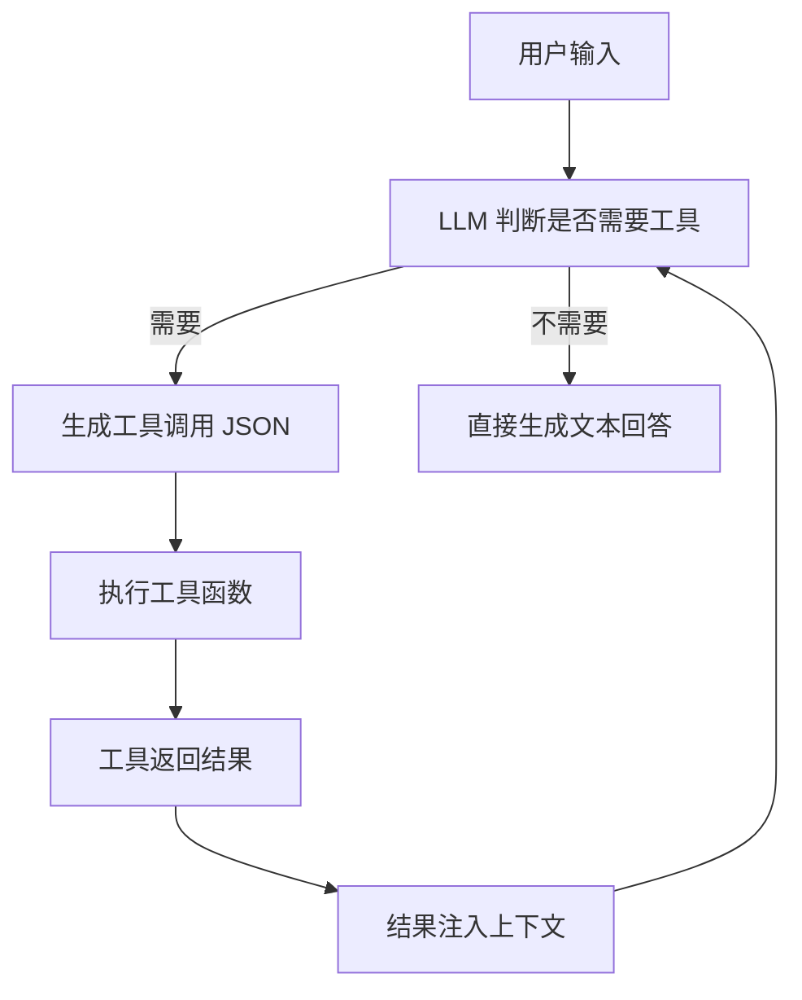
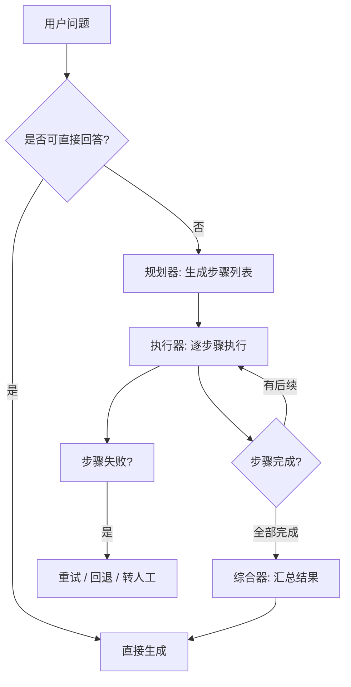
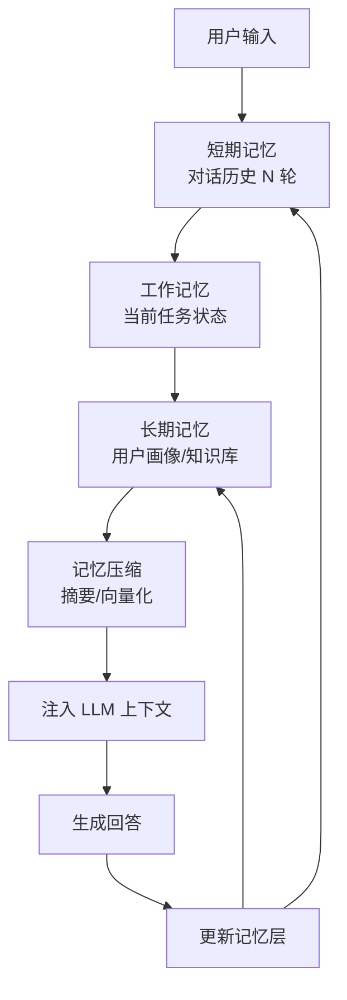

> **目标读者**：正在构建 AI Agent 系统的中文开发者，熟悉 Python 与大模型 API。
>
> 本文与 [AI Agent 工作流设计模式：从 PeterClaw Squad 实战中提炼的七条可复用原则](/zh/knowledge/ai-agent-workflow-patterns/) 形成互补——前者聚焦「多 Agent 如何协作」，本文聚焦「单个 Agent 内部如何思考与行动」。

---

## 引言：为什么 Agent 不只是「Prompt + API 调用」

2025 年以来，AI Agent 从一个 demo 概念迅速演变为工程基础设施。但「让 LLM 回答问题」和「让 Agent 自主完成任务」之间，隔着一整层架构设计。

一个能自主完成任务的 Agent，至少需要四个能力模块：

1. **知识获取**——知道在哪里找信息（RAG）
2. **工具使用**——知道如何调用外部系统（Function Calling）
3. **推理规划**——知道如何把复杂任务拆解为步骤（Multi-step Reasoning）
4. **记忆管理**——知道哪些信息该记住、哪些该遗忘（Memory）

这四个模块对应四种设计模式。本文逐一拆解它们的架构、代码实现与踩坑经验。

---

## 模式一：RAG（检索增强生成）

### 何时使用

| 场景 | 示例 |
|------|------|
| 知识库问答 | 客服机器人查询产品文档 |
| 长文档分析 | 法律合同审查、论文综述 |
| 实时信息增强 | 结合最新新闻回答时效性问题 |
| 私有数据查询 | 企业内部知识库、个人笔记检索 |

**不使用 RAG 的信号**：任务完全依赖模型预训练知识即可回答，且答案不需要引用具体来源。

### 核心架构


### 核心代码片段

**1. 文档分块与嵌入**

```python
from langchain.text_splitter import RecursiveCharacterTextSplitter
from langchain_community.vectorstores import Chroma
from langchain_openai import OpenAIEmbeddings

# 分块策略：按语义边界递归拆分
text_splitter = RecursiveCharacterTextSplitter(
    chunk_size=512,
    chunk_overlap=128,
    separators=["\n\n", "\n", "。", " ", ""]
)
chunks = text_splitter.split_documents(documents)

# 写入向量库
vectorstore = Chroma.from_documents(
    documents=chunks,
    embedding=OpenAIEmbeddings(model="text-embedding-3-small"),
    persist_directory="./chroma_db"
)
```

**2. 检索 + 重排序 + 生成**

```python
from langchain.retrievers import ContextualCompressionRetriever
from langchain.retrievers.document_compressors import CrossEncoderReranker
from langchain_community.cross_encoders import HuggingFaceCrossEncoder

# 基础检索器：召回 20 个候选
base_retriever = vectorstore.as_retriever(search_kwargs={"k": 20})

# 重排序：用轻量交叉编码器筛选 Top-5
compressor = CrossEncoderReranker(
    model=HuggingFaceCrossEncoder("BAAI/bge-reranker-base"),
    top_n=5
)
retriever = ContextualCompressionRetriever(
    base_compressor=compressor,
    base_retriever=base_retriever
)

# 生成时强制引用来源
context_docs = retriever.invoke(query)
context_text = "\n\n".join([
    f"[来源 {i+1}] {doc.page_content}"
    for i, doc in enumerate(context_docs)
])

prompt = f"""基于以下上下文回答用户问题。如果上下文不足以回答，请明确说明。
必须在回答中标注信息来源编号 [来源 N]。

上下文：
{context_text}

用户问题：{query}
"""
response = llm.invoke(prompt)
```

### 常见陷阱

| 陷阱 | 现象 | 修复方案 |
|------|------|----------|
| **块大小不当** | 512 token 切断了表格行，导致检索出的块语义不完整 | 按结构边界拆分（Markdown 标题、HTML 标签），表格作为整体保留 |
| **检索-生成错位** | 检索到的文档与用户问题相关，但缺少回答所需的特定字段 | 在 chunk metadata 中预存结构化标签（如 `产品:Pro`, `类型:定价`），检索时做元数据过滤 |
| **向量幻觉** | 余弦相似度高但语义无关的文档被召回 | 必须加一层重排序（reranker），单靠向量相似度不可靠 |
| **上下文溢出** | Top-5 文档加起来超过模型上下文窗口 | 对长文档做摘要压缩，或在检索层限制 `max_token_per_doc` |
| **没有引用** | 模型编造答案，用户无法验证 | 在 prompt 中强制要求标注来源编号，并在后处理中校验编号是否存在 |

> **实战建议**：不要自建向量数据库做生产环境。Pinecone、Qdrant、Weaviate 的托管版本在一致性、监控、多租户上的成熟度远超本地 Chroma。Chroma 适合原型验证，不适合生产。

---

## 模式二：Function Calling / Tool Use

### 何时使用

| 场景 | 示例 |
|------|------|
| 需要实时数据 | 查询天气、股价、航班状态 |
| 需要执行操作 | 发送邮件、创建日程、提交工单 |
| 需要精确计算 | 数学运算、数据分析（LLM 不擅长三位数乘法） |
| 需要与外部系统交互 | 调用内部 API、操作数据库、读写文件 |

**不使用 Function Calling 的信号**：任务只需要文本生成，不涉及任何外部状态变更或实时数据查询。

### 核心架构



### 核心代码片段

**1. 工具定义（OpenAI 格式）**

```python
tools = [
    {
        "type": "function",
        "function": {
            "name": "search_products",
            "description": "根据筛选条件查询商品列表",
            "parameters": {
                "type": "object",
                "properties": {
                    "category": {
                        "type": "string",
                        "enum": ["electronics", "clothing", "books"],
                        "description": "商品分类"
                    },
                    "max_price": {
                        "type": "number",
                        "description": "最高价格（人民币）"
                    },
                    "keyword": {
                        "type": "string",
                        "description": "搜索关键词"
                    }
                },
                "required": ["category"]
            }
        }
    },
    {
        "type": "function",
        "function": {
            "name": "calculate_shipping",
            "description": "计算运费",
            "parameters": {
                "type": "object",
                "properties": {
                    "weight_kg": {"type": "number"},
                    "destination_city": {"type": "string"}
                },
                "required": ["weight_kg", "destination_city"]
            }
        }
    }
]
```

**2. 工具执行循环**

```python
import json
from openai import OpenAI

client = OpenAI()

messages = [{"role": "user", "content": "帮我找 500 元以下的电子产品，要轻便的"}]

# 核心循环：LLM 决定调用工具还是直接回答
for _ in range(5):  # 最大 5 轮工具调用，防止无限循环
    response = client.chat.completions.create(
        model="gpt-4o",
        messages=messages,
        tools=tools,
        tool_choice="auto"
    )
    
    message = response.choices[0].message
    messages.append(message)
    
    # 如果不需要工具，直接返回
    if not message.tool_calls:
        print(message.content)
        break
    
    # 执行所有请求的工具调用
    for tool_call in message.tool_calls:
        function_name = tool_call.function.name
        arguments = json.loads(tool_call.function.arguments)
        
        # 路由到实际函数
        if function_name == "search_products":
            result = search_products(**arguments)
        elif function_name == "calculate_shipping":
            result = calculate_shipping(**arguments)
        else:
            result = {"error": f"未知函数: {function_name}"}
        
        # 将工具结果注入上下文
        messages.append({
            "role": "tool",
            "tool_call_id": tool_call.id,
            "content": json.dumps(result, ensure_ascii=False)
        })
else:
    print("达到最大工具调用轮数，强制终止")
```

**3. 安全封装：工具函数的装饰器**

```python
from functools import wraps
from typing import Any

class ToolError(Exception):
    pass

def safe_tool(max_retries=1):
    """工具函数安全装饰器：捕获异常、限制执行时间、规范化返回值"""
    def decorator(func):
        @wraps(func)
        def wrapper(*args, **kwargs):
            try:
                result = func(*args, **kwargs)
                # 规范化：确保返回可 JSON 序列化的字典
                if not isinstance(result, dict):
                    return {"result": result}
                return result
            except ToolError as e:
                return {"error": str(e)}
            except Exception as e:
                return {"error": f"工具执行异常: {type(e).__name__}: {str(e)}"}
        return wrapper
    return decorator

@safe_tool(max_retries=1)
def search_products(category: str, max_price: float = None, keyword: str = None) -> dict:
    """查询商品列表"""
    if max_price is not None and max_price < 0:
        raise ToolError("价格不能为负数")
    # ... 实际查询逻辑
    return {"products": [...], "total": 42}
```

### 常见陷阱

| 陷阱 | 现象 | 修复方案 |
|------|------|----------|
| **描述不清** | LLM 该调用工具时不调用，或传错参数 | `description` 必须明确说明「何时调用」「每个参数的语义」。测试方法：把 schema 给另一个 LLM，看它能否正确判断调用时机 |
| **无限循环** | Agent 反复调用同一工具，陷入死循环 | 设置最大轮次（如 5 轮），并在系统提示中明确「如果前一轮工具返回无新信息，不要重复调用」 |
| **参数注入** | 用户输入被拼接到工具参数中，导致 SQL 注入或命令执行 | 所有工具参数必须经过校验和转义，敏感操作（写数据、发邮件）必须二次确认 |
| **幻觉调用** | LLM 请求一个不存在的工具，或编造参数 | 在代码层严格校验 `function_name` 是否在白名单中，参数用 Pydantic 做类型校验 |
| **错误信息泄露** | 工具内部异常详情暴露给用户 | 装饰器捕获异常后返回规范化错误信息，原始堆栈只记录到日志 |

> **实战建议**：工具数量超过 10 个时，LLM 的选择准确率会明显下降。解决方案：(1) 按领域分组，先做一次意图分类，再把对应领域的 tools 注入上下文；(2) 给每个工具加 `category` 标签，在系统提示中先让 LLM 选类别再选工具。

---

## 模式三：Multi-step Reasoning（多步推理）

### 何时使用

| 场景 | 示例 |
|------|------|
| 复杂问题拆解 | 「分析这家公司过去三年的财报趋势并给出投资建议」 |
| 多条件约束 | 「找一张从北京到东京、周五出发、预算 3000 以内、可退改的机票」 |
| 依赖外部验证 | 「生成一段代码 → 运行测试 → 根据报错修复 → 再次测试」 |
| 信息补全 | 「用户只说『上次那个问题』，需要先从记忆中找到上下文」 |

**不使用 Multi-step 的信号**：问题可以直接用单次 LLM 调用回答，没有外部依赖或中间验证步骤。

### 核心架构



### 核心代码片段

**1. ReAct 模式（Reasoning + Acting）**

```python
from typing import TypedDict, List, Union

class ThoughtAction(TypedDict):
    thought: str      # 当前思考过程
    action: str       # 工具名称或 "finish"
    action_input: dict  # 工具参数
    observation: Union[str, None]  # 工具返回结果

class ReActAgent:
    def __init__(self, llm, tools, max_steps=10):
        self.llm = llm
        self.tools = {t["function"]["name"]: t for t in tools}
        self.max_steps = max_steps
    
    def run(self, query: str) -> str:
        scratchpad = f"问题：{query}\n\n"
        
        for step in range(self.max_steps):
            # 构建 ReAct 提示
            prompt = self._build_react_prompt(scratchpad)
            response = self.llm.invoke(prompt)
            
            # 解析 Thought + Action
            parsed = self._parse_response(response)
            scratchpad += f"思考 {step+1}：{parsed['thought']}\n"
            
            if parsed["action"] == "finish":
                return parsed["action_input"].get("answer", "")
            
            # 执行工具
            tool_result = self._execute_tool(
                parsed["action"], 
                parsed["action_input"]
            )
            scratchpad += f"行动：{parsed['action']}({parsed['action_input']})\n"
            scratchpad += f"观察：{tool_result}\n\n"
        
        return "达到最大步数限制，未能完成推理。"
    
    def _build_react_prompt(self, scratchpad: str) -> str:
        tool_desc = "\n".join([
            f"- {name}: {t['function']['description']}"
            for name, t in self.tools.items()
        ])
        return f"""你是一个推理助手。按以下格式思考并行动：

可用工具：
{tool_desc}

格式要求：
思考：[你的推理过程]
行动：[工具名称] 或 finish
行动输入：[JSON 格式参数]

{scratchpad}
思考："""
    
    def _parse_response(self, response: str) -> ThoughtAction:
        # 简化的解析逻辑，生产环境建议用结构化输出
        ...
    
    def _execute_tool(self, name: str, inputs: dict) -> str:
        if name not in self.tools:
            return f"错误：工具 {name} 不存在"
        # 实际调用工具...
```

**2. 规划-执行分离（Plan-and-Execute）**

```python
from pydantic import BaseModel

class Step(BaseModel):
    step_number: int
    description: str
    tool: str | None
    tool_input: dict
    expected_output: str

class Plan(BaseModel):
    steps: List[Step]
    estimated_completion: str

def plan_and_execute(query: str, planner_llm, executor_llm, tools) -> str:
    # Phase 1: 规划
    plan = planner_llm.invoke(
        f"将以下问题拆解为可执行步骤，返回结构化 Plan：\n{query}",
        response_format=Plan
    )
    
    # Phase 2: 执行（每步可并行或串行）
    results = []
    for step in plan.steps:
        if step.tool:
            tool_args = step.tool_input
            result = tools[step.tool](**tool_args)
        else:
            result = executor_llm.invoke(step.description)
        results.append({"step": step.step_number, "result": result})
    
    # Phase 3: 综合
    summary = executor_llm.invoke(
        f"基于以下执行结果，给出最终回答：\n{results}"
    )
    return summary
```

**3. 链式验证（Chain-of-Verification）**

```python
def chain_of_verification(query: str, llm, verifier) -> str:
    """先生成草稿，再验证每个事实，最后修正"""
    
    # Step 1: 生成初始回答
    draft = llm.invoke(f"回答以下问题：{query}")
    
    # Step 2: 提取可验证声明
    claims_prompt = f"""从以下回答中提取所有需要验证的事实声明，每行一条：
{draft}"""
    claims = llm.invoke(claims_prompt).strip().split("\n")
    
    # Step 3: 逐一验证
    verified = []
    for claim in claims:
        if not claim.strip():
            continue
        evidence = verifier.search(claim)
        is_correct = llm.invoke(
            f"声明：{claim}\n证据：{evidence}\n该声明是否正确？是/否/不确定"
        )
        verified.append({"claim": claim, "correct": is_correct, "evidence": evidence})
    
    # Step 4: 生成修正版
    final = llm.invoke(
        f"基于以下验证结果，重写回答（修正错误、保留正确信息）：\n{verified}"
    )
    return final
```

### 常见陷阱

| 陷阱 | 现象 | 修复方案 |
|------|------|----------|
| **规划过于宏大** | Agent 生成 20 步计划，执行到第 3 步就偏离目标 | 限制单步粒度（15 分钟内可完成），每步后做「目标一致性检查」 |
| **中间结果污染** | 某步工具返回错误信息，后续步骤基于错误信息继续推理 | 每步后加「结果可信度评估」，低可信度时触发回退或重试 |
| **循环依赖** | Step B 依赖 Step A，但 Step A 的输出格式与 Step B 预期不符 | 在规划阶段定义每步的输入/输出 schema，执行时做严格类型校验 |
| **成本爆炸** | 多步推理消耗大量 token，单次查询成本超过预期 | 为规划器和执行器使用不同模型（规划用强模型，执行用轻量模型） |
| **无法中断** | 用户想中途修改需求，但 Agent 继续按原规划执行 | 每步执行前检查是否有新用户输入，支持「打断-重规划」 |

> **实战建议**：不要一上来就用最复杂的 ReAct。先评估问题复杂度：
> - L1 简单问题（单次调用可解）→ 直接调用 LLM
> - L2 中等问题（2-3 步确定流程）→ Plan-and-Execute，预生成计划
> - L3 复杂问题（流程不确定，需要试错）→ ReAct，动态决策下一步

---

## 模式四：Memory 管理策略

### 何时使用

| 场景 | 需要的记忆类型 |
|------|---------------|
| 多轮对话保持上下文 | 短期记忆（对话历史） |
| 用户偏好学习（常用地址、偏好语言） | 长期记忆（用户画像） |
| 复杂任务的中中间状态 | 工作记忆（当前任务上下文） |
| 跨会话持续学习 | 长期记忆 + 记忆压缩/摘要 |

### 核心架构



### 核心代码片段

**1. 分层记忆实现**

```python
from typing import List, Dict, Optional
from dataclasses import dataclass, field
from datetime import datetime

@dataclass
class MemoryLayer:
    """记忆层基类"""
    max_tokens: int
    entries: List[dict] = field(default_factory=list)
    
    def add(self, entry: dict) -> None:
        self.entries.append({
            **entry,
            "timestamp": datetime.now().isoformat()
        })
        self._compress_if_needed()
    
    def get_context(self, query: Optional[str] = None) -> str:
        raise NotImplementedError
    
    def _compress_if_needed(self):
        raise NotImplementedError

class ShortTermMemory(MemoryLayer):
    """短期记忆：最近 N 轮对话，滑动窗口"""
    
    def __init__(self, max_turns: int = 10):
        super().__init__(max_tokens=4000)
        self.max_turns = max_turns
    
    def add(self, role: str, content: str):
        super().add({"role": role, "content": content})
        # 滑动窗口：只保留最近 N 轮
        self.entries = self.entries[-self.max_turns:]
    
    def get_context(self, query=None) -> List[dict]:
        return [{"role": e["role"], "content": e["content"]} 
                for e in self.entries]
    
    def _compress_if_needed(self):
        pass  # 滑动窗口天然控制长度

class WorkingMemory(MemoryLayer):
    """工作记忆：当前任务的关键事实和中间状态"""
    
    def __init__(self):
        super().__init__(max_tokens=2000)
        self.facts: Dict[str, str] = {}
    
    def set_fact(self, key: str, value: str):
        self.facts[key] = value
    
    def get_fact(self, key: str) -> Optional[str]:
        return self.facts.get(key)
    
    def get_context(self, query=None) -> str:
        lines = ["【当前任务状态】"]
        for k, v in self.facts.items():
            lines.append(f"- {k}: {v}")
        return "\n".join(lines)
    
    def _compress_if_needed(self):
        pass  # 工作记忆由应用层主动管理生命周期

class LongTermMemory(MemoryLayer):
    """长期记忆：用户画像 + 历史摘要，持久化存储"""
    
    def __init__(self, user_id: str, vector_store):
        super().__init__(max_tokens=3000)
        self.user_id = user_id
        self.vector_store = vector_store
        self.profile: Dict = self._load_profile()
    
    def add(self, summary: str, metadata: dict = None):
        super().add({"summary": summary, "metadata": metadata or {}})
        self.vector_store.add_texts([summary], metadatas=[metadata])
    
    def get_context(self, query: str) -> str:
        # 检索相关历史记忆
        docs = self.vector_store.similarity_search(query, k=3)
        memories = [d.page_content for d in docs]
        
        lines = ["【用户画像】"]
        for k, v in self.profile.items():
            lines.append(f"- {k}: {v}")
        lines.append("\n【相关历史】")
        for i, m in enumerate(memories, 1):
            lines.append(f"{i}. {m}")
        return "\n".join(lines)
    
    def _load_profile(self) -> Dict:
        # 从数据库加载用户画像
        return {"language": "zh", "timezone": "Asia/Shanghai"}
    
    def _compress_if_needed(self):
        # 月度摘要：将旧条目压缩为摘要
        pass
```

**2. 记忆注入与上下文组装**

```python
class AgentWithMemory:
    def __init__(self, llm, vector_store):
        self.llm = llm
        self.short_term = ShortTermMemory(max_turns=10)
        self.working = WorkingMemory()
        self.long_term = LongTermMemory("user_001", vector_store)
    
    def chat(self, user_input: str) -> str:
        # 1. 更新短期记忆
        self.short_term.add("user", user_input)
        
        # 2. 组装上下文
        messages = [
            {"role": "system", "content": "你是一个有帮助的助手。"},
            {"role": "system", "content": self.long_term.get_context(user_input)},
            {"role": "system", "content": self.working.get_context()},
        ]
        messages.extend(self.short_term.get_context())
        
        # 3. 生成回答
        response = self.llm.invoke(messages)
        
        # 4. 更新记忆
        self.short_term.add("assistant", response)
        
        # 5. 提取关键事实到工作记忆
        if "我的邮箱是" in user_input:
            email = self._extract_email(user_input)
            self.working.set_fact("user_email", email)
        
        return response
```

**3. 记忆摘要与压缩**

```python
def summarize_conversation(history: List[dict], llm) -> str:
    """将长对话压缩为结构化摘要"""
    conversation = "\n".join([
        f"{e['role']}: {e['content']}" for e in history
    ])
    
    prompt = f"""将以下对话压缩为结构化摘要，保留：
1. 用户明确表达的需求和偏好
2. 已确认的关键事实（地址、时间、偏好设置等）
3. 未完成的待办事项
4. 重要的情绪信号

对话：
{conversation}

摘要："""
    return llm.invoke(prompt)

# 使用场景：当短期记忆超过 max_turns 时，将旧对话摘要存入长期记忆
old_turns = short_term.entries[:5]
summary = summarize_conversation(old_turns, llm)
long_term.add(summary, metadata={"type": "conversation_summary", "date": "2026-05-26"})
```

### 常见陷阱

| 陷阱 | 现象 | 修复方案 |
|------|------|----------|
| **记忆膨胀** | 长期记忆无限增长，每次查询检索到无关旧信息 | 给记忆条目加 TTL（生存时间），定期清理；检索时按时间衰减加权 |
| **记忆污染** | 错误信息被记住后持续影响后续回答 | 给每条记忆加「置信度」标签，低置信度记忆不参与检索 |
| **上下文截断** | 三层记忆加起来超过模型上下文窗口 | 计算每层记忆 token 数，按优先级截断（工作记忆 > 短期记忆 > 长期记忆） |
| **隐私泄露** | 用户 A 的记忆被注入到用户 B 的上下文 | 严格的用户 ID 隔离，多租户架构下向量库必须按 user_id 做 namespace 隔离 |
| **忘记遗忘** | 用户明确要求删除某条信息，但向量库中仍有残留 | 删除时同时清除原始记录和向量嵌入，删除后做一致性校验 |

> **实战建议**：不要过度设计记忆系统。绝大多数应用只需要「最近 10 轮对话 + 一个用户偏好字典」就能工作得很好。向量检索的长期记忆只在 (1) 跨会话场景 (2) 大量历史需要检索 时才必要。先做简单方案，有明确痛点再引入向量库。

---

## 总结：四大模式速查表

| 模式 | 解决什么问题 | 核心组件 | 选型关键词 |
|------|-------------|----------|-----------|
| **RAG** | LLM 知识不足/过时 | 向量库 + 重排序 + 引用生成 | 知识库、文档问答、私有数据 |
| **Function Calling** | LLM 无法直接执行操作 | 工具定义 + 执行循环 + 安全校验 | 实时数据、外部 API、状态变更 |
| **Multi-step Reasoning** | 复杂问题无法单次解决 | 规划器 + 执行器 + 验证器 | 拆解、推理链、自主纠错 |
| **Memory** | 上下文丢失、无个性化 | 短期/工作/长期三层 + 摘要压缩 | 多轮对话、用户画像、跨会话 |

### 组合使用示例

一个完整的 Agent 通常同时需要多个模式：

```
用户："我上周问过的那个日本旅行计划，现在帮我查一下 6 月 15 日
      从东京到大阪的新干线班次，预算要控制在 2 万日元以内。"

Agent 内部流程：
1. Memory → 从长期记忆中检索「日本旅行计划」的上下文
2. Memory → 确认用户偏好（经济型、喜欢早班车）
3. Function Calling → 调用新干线查询工具
4. Multi-step → 如果直达班次超预算，规划「普通车+特急」组合方案
5. RAG → 从旅行攻略知识库中检索「JR Pass 是否划算」的建议
6. Memory → 将本次查询结果保存到工作记忆，供后续对话使用
```

---

## 相关阅读

- [AI Agent 工作流设计模式：从 PeterClaw Squad 实战中提炼的七条可复用原则](/zh/knowledge/ai-agent-workflow-patterns/) —— 多 Agent 协作层面的设计模式
- [内容架构：博客与知识库双轨](/zh/knowledge/content-architecture/) —— PeterClaw 网站的内容系统设计说明
- [AI 日记 Vol.5：Vibe Coding 与多智能体协作实战](/zh/blog/ai-diary-005-vibe-coding/) —— 自然语言驱动全栈开发的技术实践
- [当七个 AI 组成一家公司——多智能体协作的真实体验](/zh/blog/ai-diary-005-multi-agent-collaboration/) —— 七人小队完整协作实录

---

**English Abstract**

This article provides a systematic overview of four core AI Agent design patterns in 2026: (1) **RAG (Retrieval-Augmented Generation)** — covering chunking strategies, vector retrieval, cross-encoder reranking, and citation-enforced generation; (2) **Function Calling / Tool Use** — including tool schema design, execution loops with safety decorators, and anti-loop protections; (3) **Multi-step Reasoning** — comparing ReAct, Plan-and-Execute, and Chain-of-Verification approaches with full Python implementations; and (4) **Memory Management** — a three-tier architecture (short-term sliding window, working memory for task state, and long-term vector-based persistence) with summarization and compression techniques. Each pattern includes a "when to use" decision matrix, production-ready code snippets, and a "common pitfalls" table derived from real-world deployment experience. The article is designed as a technical complement to the workflow-level patterns documented in the companion piece on multi-agent collaboration.
